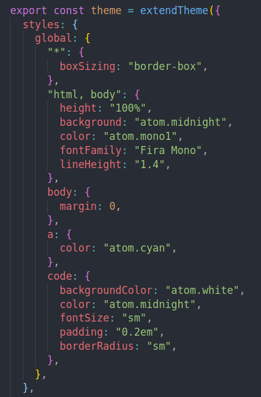
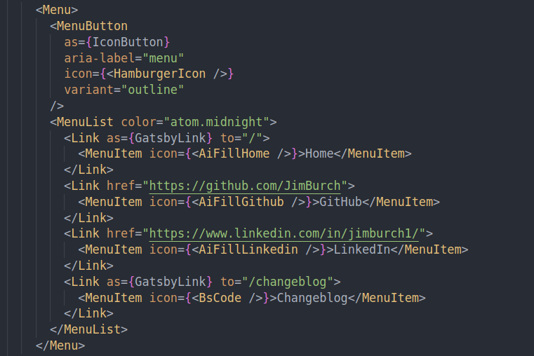

import { AspectRatio } from "@chakra-ui/react";

There's a scene in my favorite episode of South Park, "Make Love, Not Warcraft," where Cartman and the gang spend weeks hunting boars in World of Warcraft so they can defeat a character who keeps killing them in the game. After hundreds of hours and dozens of hot pockets, they win the battle. Stan asks, "What do we do now?" Cartman responds, "What do you mean? Now we can finally play the game."

  <AspectRatio>
    <iframe
      width="560"
      height="315"
      src="https://www.youtube.com/embed/IpC4tkWDvfM"
      title="YouTube video player"
      frameborder="0"
      allow="accelerometer; autoplay; clipboard-write; encrypted-media; gyroscope; picture-in-picture"
      allowfullscreen
    ></iframe>
  </AspectRatio>

That's what it felt like to set up Chakra UI on Gatsby, but it was worth it.

### Chakra UI and Gatsby JS

All I wanted a simple drop-down menu for mobile navigation. At the time, I was content with simple CSS for styling and didn't want to wrap my entire app in a new CSS framework (I did enough of that during my Hack Reactor days before really learning CSS).

Then came the Great Chakra Clash.

My `global.css` styles did not like it when I added Chakra UI to my `gatsby-config.js` file and was immediately overridden by Chakra's default theme.

Luckily, Chakra can pass a custom theme to a `ChakraProvider` with a global style object. As you can see, I got real original and grabbed the colors from Atom's "One Dark" theme and gave my portfolio a VSCode look.

Once I had the global styles object in place, I could go on using my CSS modules for the rest of my components.

### Chakra UI Components

Oh yeah, speaking of that one component I wanted... tap the hamburger icon at the top right of the screen (if you're on mobile). This is where Chakra shines. Their components are much cleaner and more simple to use than Bootstrap or Material UI, in my opinion.

Chakra has tons of options with component props, declaring components as other elements (you can see where the `Link` component is declared as a `GatsbyLink` for app routing), and plays nicely with svg icons from other libraries.

Now that setup is complete, I can finally play the game.

### The New Drip

I know, I must be the millionth developer to rock a VSCode-theme portfolio but, damn it, it looks so good! The V1 green/aqua was just a random color selection as I was getting started -- this is the theme I'll be sticking with for a while.

### Challenges

I didn't write about this in my last release, but I spent more than a week dealing with an infuriating bug that prevented my site from rendering a preview on LinkedIn -- the one social site I needed it to work.

I tried everything: switching the order of my `meta` tags, [following LinkedIn's docs](https://www.linkedin.com/help/linkedin/answer/a521928/making-your-website-shareable-on-linkedin?lang=en) verbatim, clearing server cache, [posted the question on Gatsby's forum](https://github.com/gatsbyjs/gatsby/discussions/35123) (that no one answered), messing with canonical URL's, and so much more.

It turns out, the problem was my host: Heroku (I think). I dropped it, switched to Netlify, and haven't been happier. Netlify is super easy to use and on top of rendering link images on LinkedIn, I like it's user experience much more.

### What's Next

This is awkward, but, it's not really a portfolio with any of my work, is it? I'll be brushing up some projects and putting them front and center for all to see. Until next time...
