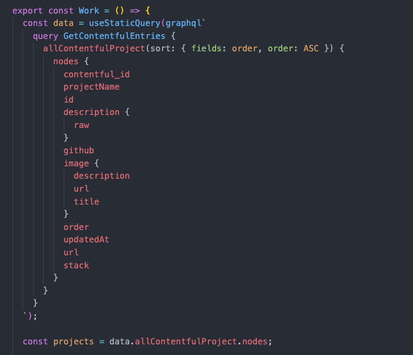
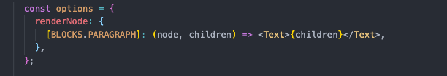

Yes, this portfolio is a place to learn a new framework (Gatsby JS). Yes, this portfolio is also a place to experiment with new things (MDX). But really, this portfolio is a place for me to show my work -- that's what this update is all about.

### Contentful

I probably could have hard-coded my project data -- I'm only currently showing three, including this portfolio -- but I wanted to future proof that process and connect a CMS for seamless updates.

I'm learning that Gatsby has official plugins for just about everything, and it plays nicely with [Contentful](https://www.contentful.com/) using `gatsby-source-contentful` and `renderRichText` (more on that in a moment). The plugin and API keys go right in your Gatsby config, and GraphQL pulls in the data how you want.

You can see how GraphQL queries fields like title, description, image, and orders the response accordingly:

The "rich text" field takes in different text styles on Contentful's side and spits out code that `richTextRender` translates to HTML. It takes an optional second argument, `options`, that lets you customize how certain HTML elements are displayed. For example, I used Chakra's `Text` component for paragraphs and can include that in the options object:

### Scalability

The project card design looks good for a handful of entries but will get cumbersome after five or six, especially in mobile where the cards are vertical. In the future, I'll probably shrink down the cards into a grid system that either expand to show a description or just show an image, title, and GitHub Links.

### Smooth Scroll

With two sections on the home page, I wanted an easy smooth scroll from "Home" module to the "Work" when clicking on the Work button in the navigation bar. `gatsby-plugin-anchor-links` was perfect for this -- just wrap your button or text in `<AnchorLink>` and it will automatically implement the smooth scroll. Just make sure whatever you're wrapping doesn't have its own routing or you will run into ref errors.

### Next Steps

It's looking like a real portfolio! There are still some fun projects to add to my Work section and I have a running list of updates that don't warrant a write-up here (like a breadcrumbs navigation component). I'll also eventually move on from vanilla CSS modules and to something like React-JSS.
